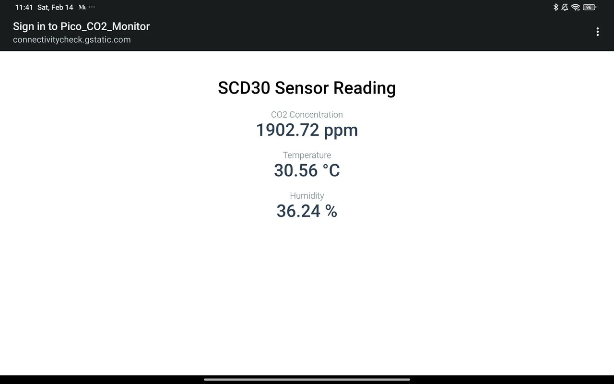

# Pico SCD30 Access Point

This repository contains a C-based project for the **Raspberry Pi Pico W** that transforms the device into a standalone Wi-Fi Access Point and Web Server to monitor CO2, temperature, and humidity using a **Sensirion SCD30 sensor**.

## Screenshot

## Features
* **Standalone Access Point:** Hosts a Wi-Fi network named `Pico_CO2_Monitor`.
* **Web Dashboard:** Serves a mobile-friendly HTML interface that auto-refreshes every 3 seconds to display real-time sensor data.
* **Integrated Network Services:** Includes a built-in DHCP server and DNS server to provide a seamless "captive portal-like" experience.
* **Thread-Safe Networking:** Utilizes `pico_cyw43_arch_lwip_threadsafe_background` for stable Wi-Fi and sensor concurrent operations.
* **Robust Sensor Handling:** Implements a blocking read with retries to mitigate I2C collisions during Wi-Fi activity.

## Hardware Requirements
* **Raspberry Pi Pico W** or Pico 2 W.
* **Sensirion SCD30** Sensor.

### Wiring:
| SCD30 Pin | Pico W Pin |
| :--- | :--- |
| VCC | 3V3 / VSYS |
| GND | GND |
| SDA | GPIO 4  |
| SCL | GPIO 5  |

### Repository Structure
* `main.c`: Core application logic, Web Server, and sensor polling loop.
* `dhcpserver/`: Implementation of a lightweight DHCP server for assigning client IPs.
* `dnsserver/`: A simple DNS server that resolves all queries to the Pico's IP (192.168.4.1).
* `sensirion_i2c_hal.c`: Hardware Abstraction Layer mapping Sensirion's I2C calls to the Pico SDK.
    - Can configure I2C pins and speed via `sensirion_i2c_hal_init()`.
* `lwipopts.h`: Optimized LwIP configuration for Access Point and DHCP functionality.

## Build and Flash

1. Use VSCode with the official [Pico extension](https://marketplace.visualstudio.com/items?itemName=raspberry-pi.raspberry-pi-pico) for easier building and flashing.
2. `Ctlr+Shift+P` -> `CMake: Configure`
3. Click `Compile` in bottom bar.
4. Put your Pico W into BOOTSEL mode (hold the BOOTSEL button while plugging it in).
5. Click `Run` in bottom bar to flash the firmware.

## Usage
1. Power the Pico W.
2. Connect your phone or computer to the Wi-Fi network **"Pico_CO2_Monitor"** using the password **"12345678"**.
3. Open a web browser and navigate to `http://192.168.4.1`.
4. The dashboard will display current CO2 (ppm), Temperature (°C), and Humidity (%).

## Notes
* The SCD30 sensor is set to a 2-second measurement interval to balance responsiveness and I2C stability.
* The web page auto-refreshes every 3 seconds to provide near real-time updates without overwhelming the network or sensor.
* The I2C bus rate was set to 50kHz which seems to prevent the senor from locking up.
* Probably should not add more sensors to the same I2C bus.

## License
This project is licensed under the MIT License - see the [LICENSE](LICENSE) file for details

## Acknowledgments
* [picow_access_point example](https://github.com/raspberrypi/pico-examples/tree/master/pico_w/wifi/access_point)
* [Sensirion Embedded I2C SCD30 Driver](https://github.com/Sensirion/embedded-i2c-scd30)